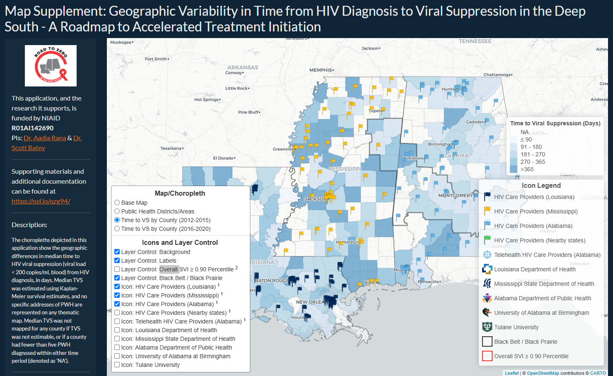
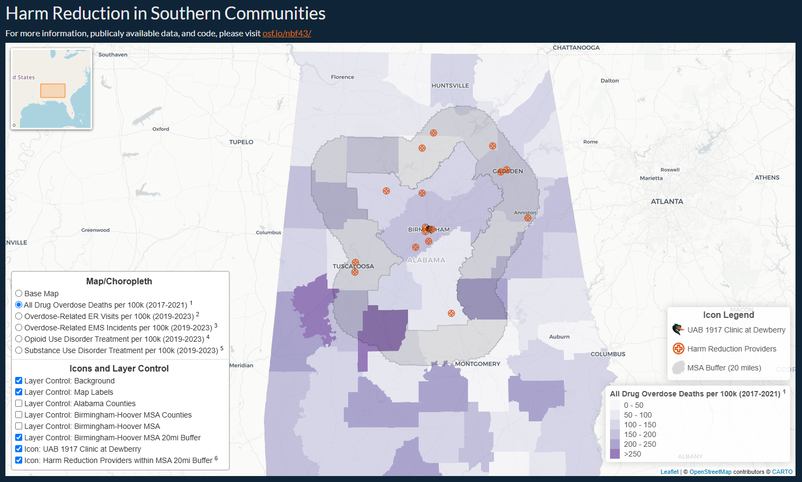

::: {.shiny-hero}

<canvas id="topo-canvas" aria-hidden="true"></canvas>

::: {.shiny-hero-text}
Selected and publicly available R Shiny applications and related dashboards used to support various projects and research initiatives.
:::

:::

<!--
  Each entry below is one .app-entry card: a thumbnail image, a short
  description, a primary link to the live app, and (when one exists) a
  secondary link to the OSF repository. To add a new one, copy a whole
  block (from ::: {.app-entry} to the closing :::) and edit its three
  parts: the img src, the description text, and the two links.
-->

::: {.app-entry}

**SPARTO-Choropleths** — open-access dashboard for geographic visualization of HIV care continuum outcomes.

[Open app](https://jbassler.shinyapps.io/SPARTO-Choropleths/) · [OSF repository](https://doi.org/10.17605/OSF.IO/4H5WY){target="_blank"}

:::

::: {.app-entry}

**Neighborhood-Level Financial Exclusion and Cancer Screening Disparities in the U.S., 2017–2022** — web-based dashboard depicting choropleths illustrating the temporal and geographic variability of home loan denial rates and cancer screening rates (colorectal, breast, and cervical) by U.S. census tract.

[Open dashboard](https://arcg.is/1bnK4K){target="_blank"} · [OSF repository](https://doi.org/10.17605/OSF.IO/WC598){target="_blank"}

:::

::: {.app-entry}

**Geographic Variability in Time from HIV Diagnosis to Viral Suppression in the Deep South** — map supplement to the geospatial analysis of HIV testing coverage across the Southeast.

[Open app](#){https://jbassler.shinyapps.io/UAB-RTZ-app/} · [OSF repository](https://doi.org/10.17605/OSF.IO/QZG94){target="_blank"}

:::

::: {.app-entry}

**Epidemic Preparedness and Vaccine Equity: Access for All** — map supplement exploring vaccine access and epidemic preparedness.

[Open app](#){https://jbassler.shinyapps.io/AL-COVID19-DG/} · [OSF repository](https://doi.org/10.17605/OSF.IO/FBGEC){target="_blank"}

:::

::: {.app-entry}

**Comprehensive Harm Reduction and Medicine (CHRM) in Alabama** — map supplement on harm reduction resource access in Alabama.

[Open app](#){https://jbassler.shinyapps.io/CRHM-AL-Providers/} · [OSF repository](https://doi.org/10.17605/OSF.IO/5GDA4){target="_blank"}

:::

::: {.app-entry}

**Redlining and Time to Viral Suppression Among Persons With HIV** — map supplement to the *JAMA Internal Medicine* redlining study (see [Publications](publications.qmd) and [Press](press.qmd)).

[Open app](#){https://jbassler.shinyapps.io/NOLA-TVS-Redlining/} · [OSF repository](https://doi.org/10.17605/OSF.IO/YJKUN){target="_blank"}

:::

