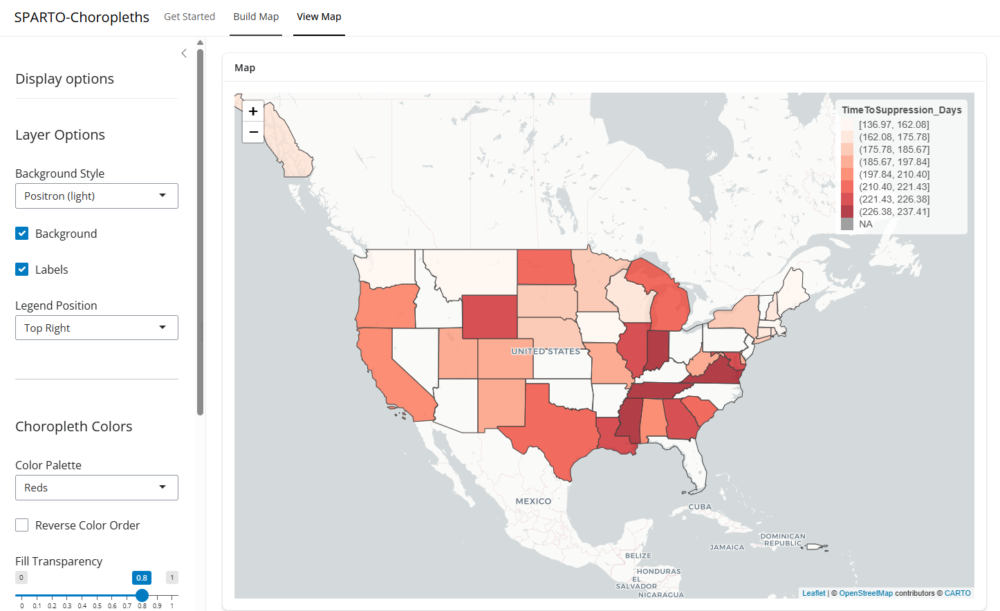
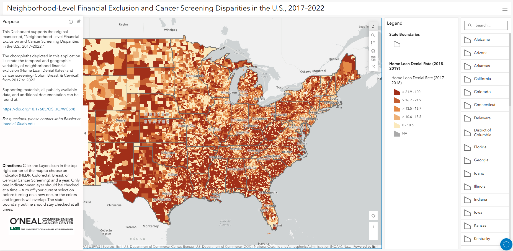
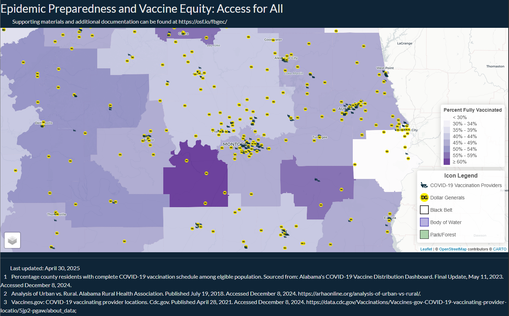

Selected and publicly available R Shiny applications and related dashboards used to support various projects and research initiatives.

<!--
  Each entry below is one .app-entry card: a thumbnail image, a short
  description, a primary link to the live app, and (when one exists) a
  secondary link to the OSF repository.
-->

::: {.app-entry}

**SPatial Analysis Rendering Tool for Outcomes-based research (SPARTO)** — Shiny App to quickly build choropleth maps from User provided data. This application supports any spatially-referenced output that the User wishes to visualize in a choropleth.

[Open Shiny App](https://jbassler.shinyapps.io/SPARTO-Choropleths/) · [OSF Repository](https://doi.org/10.17605/OSF.IO/4H5WY){target="_blank"}

:::

::: {.app-entry}

**Neighborhood-Level Financial Exclusion and Cancer Screening Disparities in the U.S., 2017–2022** — Web-based Dashboard depicting choropleths illustrating the temporal and geographic variability of home loan denial rates and cancer screening rates (Colorectal, Breast, and Cervical) by US census tract.

[Open Dashboard](https://doi.org/10.17605/OSF.IO/26EJC) · [OSF Repository](https://doi.org/10.17605/OSF.IO/FBGEC){target="_blank"}

:::

::: {.app-entry}

**Epidemic Preparedness and Vaccine Equity: Access for All** — Shiny App depicting the location of Dollar General stores and commericial vaccination providers (e.g., Walgreens, CVS, etc.) in Alabama, as well as, choropleths county-level COVID-19 vaccination rates.

[Open Shiny App](https://jbassler.shinyapps.io/AL-COVID19-DG/) · [OSF Repository](https://doi.org/10.17605/OSF.IO/FBGEC){target="_blank"}

:::

::: {.app-entry}

**Map Supplement: Redlining and Time to Viral Suppression Among Persons With HIV** — Shiny App accompanying a study examining the relationship between historical redlining (1930s-era HOLC residential security grades) and time to viral suppression among persons with HIV in New Orleans, Louisiana. The full manuscript is available [HERE](https://pmc.ncbi.nlm.nih.gov/articles/PMC11536221/).

[Open Shiny App](https://jbassler.shinyapps.io/NOLA-TVS-Redlining/) · [OSF Repository](https://doi.org/10.17605/OSF.IO/YJKUN){target="_blank"}

:::

